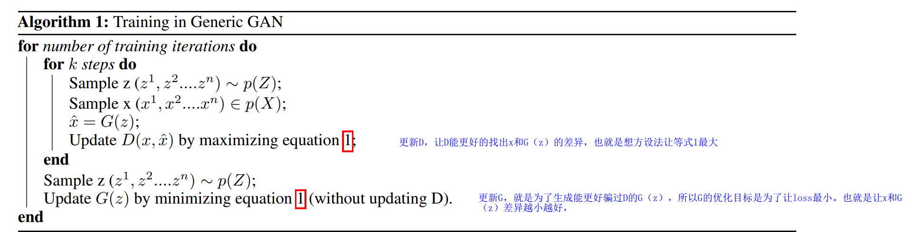
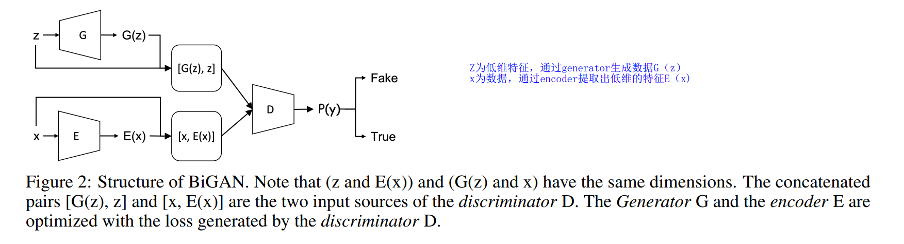
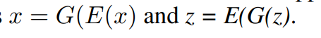
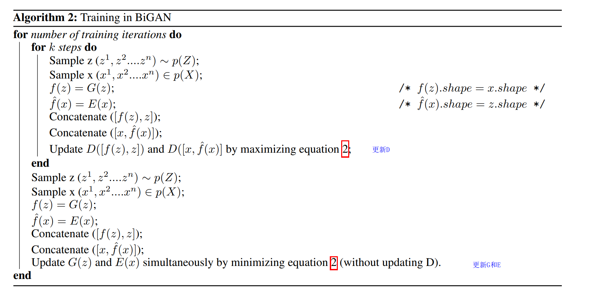

TRAINING A BIDIRECTIONAL GAN-BASED ONE-CLASS CLASSIFIER FOR NETWORK INTRUSION DETECTION  

[toc]

# contributes

propose a new training strategy based on Bidirectional GAN (Bi-GAN)  说白了就是生成器和鉴别器不需要同时训练

1. We relax the requirement for the generator and the discriminator to train in sync.  The ==generator== (along with the encoder) in our proposed model goes through ==more rigorous training iterations== .Our proposed model shows that the generator’sperformance is greatly improved by offering the generator (and encoder) to train more than the discriminator,which in turn, also actually improves the discriminator’s performance better.  

2. a cross-entropy is used to keep track of the overall balance in terms of the number of relative training iterations required for the generator and the discriminator. 

   In addition, we employ a ==-log (D) trick== to train the generator to obtain sufficient gradient in the early training stage by ==inverting the label.==

3. We offer new construction of a one-class classifier using the trained encoder-discriminator for detecting  anomalous traffic from normal traffic instead of having to calculate either anomaly scores or thresholds which  are computationally expensive and complex.

4. Our experimental result shows that our proposed method is highly effective in using a GAN-based model for  network anomaly detection tasks by achieving more than 92% F1-score.

# abstract

We argue that this strong dependency required for the natural image datasets
often doesn’t work in imbalanced text-based datasets such as network intrusion traffic samples where
the semantic relationship across text features handled by the generator and the discriminator differ.  我们认为，这种对自然图像数据集要求的强依赖通常不适用于不平衡的基于文本的数据集，如网络入侵流量样本，因为生成器和鉴别器处理的文本特征之间的语义关系不同。

在我们提出的方法中，生成器(以及相应的编码器)的训练迭代从鉴别器的训练中分离出来，直到它满足与交叉熵损失相关的条件。

提出一种a new construct of a one-class classifier using the trained encoder-discriminator.  By offering a one-class (binary) classifier, a complex calculation involved in finding threshold or anomaly score can be avoided  

 In addition, by allowing more training of the generator and the encoder, our model produces the fake
datasets with its underlying semantic representation intact similar to the real data.  

We plan to extend our work as a general data argumentation engine to produce a synthetic dataset for minority classes  often used in DDoS(还有恶意软件,勒索软件,安卓软件,x射线) attack classification.

# introduction

生成对抗网络一般,在生成fake image效果好,但是在text-based data processing 领域效果不好,such as network intrusion detection tasks where working with the feature sets whose semantic representation differs across the generator and the discriminator.   

# related work

The work suggested by Sadaf and Sultana [2020] used autoencoder to gain 88.98% accuracy in network intrusion detection based on the NSL-KDD dataset .

GANs had not been used for intrusion detection until 2017   

The difficulty behind the GAN-based approach is with the way of obtaining what to consider anomalous  

AnoGAN proposed two losses to form the anomaly score. Since the generator is trained to synthesize data from real  data, the first loss residual loss is offered to capture the difference between normal data and its synthetic data. The other  loss is offered discriminator loss to measure the divergence between the output of the discriminator fed with real data  and synthetic data.. In the proposal, the discriminator loss is computed by comparing the result of the discriminator’s intermediate layer rather than the output layer  

The generic GAN model does not have the ability to map from data to latent space thus it is expensive to find the best features in latent space which can generate the most suitable data in computing the residual loss.   所以需要adding an encoder before the generator to map from data to the latent space.  

# background

## 传统 GAN

## Bidirectional GAN  

训练分成两步：

1. 训练discriminator，来最大化目标函数。
2. 训练generator和encoder最小化相同的目标函数。

The Generator G and the encoder E are optimized with the loss generated by the discriminator D 。

Different from the standard GAN approach, a concatenation operation is added in the discriminator. The  concatenation is to link the data x (or G(z)) with its latent space E(x) (or z) and these two concatenated data are then  inputted into the discriminator.

# our proposed model

maps them to a low dimensional vector in a latent space  

discriminator更容易收敛，所以generator应该训练次数比discriminator多来保证在两者之间训练的平衡。

